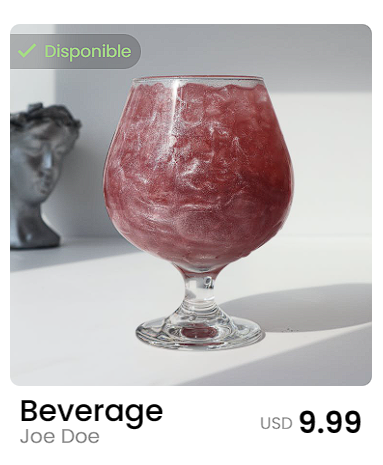
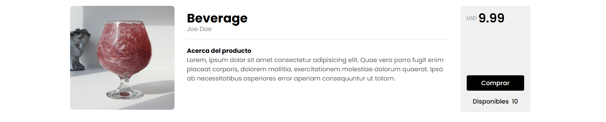

# Prueba técnica Uey.mx

## Diagrama de arquitectura del sistema


Se definieron 3 tipos de estructuras las cuales representan cada uno de los productos a exhibir: 'ProductSimple', 'ProductRentable', 'ProductPlace'. Como cada uno almacena atributos en común se decidió crear una unión que representara un producto en general llamada 'Product', dicha unión sería el tipo que retornan las queries de GraphQL para simplificar las consultas realizadas por el cliente. También se generó un enum como estructura de valores predefinidos en el tipo de renta de producto rentable para mantener los posibles valores ordenados y acotados, dado que no sería posible que se ingresara otro valor diferente de 'PER_NIGHT' y 'PER_HOUR'.

Los datos fueron construidos con arreglos dummy para evitar la conexión a una base de datos y facilitar el desarrollo.

```javascript
const PRODUCTS = [...dummies]
```

De dicho arreglo es donde se procesan las peticiones y se retorna la información filtrada. Se usaron dos consultas:

```javascript
const Queries = {
  allProducts: () => PRODUCTS, // Returns all products
  findProduct: (_, { name }) => PRODUCTS.find(product => product.name === name) // Returns the found product
}
```

Finalmente el cliente deberá ingresar consultas en GraphQL de esta forma:

### Obtener todos los productos

```graphql
query {
  allProducts {
    ... on ProductSimple {
      __typename
      name
      seller
      image
      price
      stock
    }
    ... on ProductRentable {
      __typename
      name
      seller
      image
      price
      rentType
      rentedDate {
        from
        to
      }
    }
    ... on ProductPlace {
      __typename
      name
      seller
      image
      price
      location
      rentedDate {
        from
        to
      }
    }
  }
}
```

### Obtener solo un producto por nombre

```graphql
query {
  query findProductbyName($name: String!) {
    findProduct(name: $name) {
      ... on ProductSimple {
        __typename
        name
        seller
        image
        price
        stock
      }
      ... on ProductRentable {
        __typename
        name
        seller
        image
        price
        rentType
        rentedDate {
          from
          to
        }
      }
      ... on ProductPlace {
        __typename
        name
        seller
        image
        price
        location
        rentedDate {
          from
          to
        }
      }
    }
  }
}
```

## Código

En el directorio del proyecto se encuentran 2 carpetas llamadas [back-end](https://github.com/JCiroLo/uey-technical-test/tree/main/backend) y [front-end](https://github.com/JCiroLo/uey-technical-test/tree/main/frontend). Allí se encuentra el código fuente de la aplicación. Para ejecutar el servidor y poder visualizar la aplicación se debe ingresar el comando `npm start` en los directorios mencionados.


## Decisiones tomadas

- Se estableció una arquitectura en el backend usando el modelado de GraphQL, a pesar de haber un solo producto se decidió hacer uso de herencia dado que habían atributos en común entre los diferentes tipos de producto como lo son nombre, vendedor, precio e imagen, y posteriormente hacer los tipos de productos como sub-clases con sus atributos extra como disponibilidad y ubicación sin embargo, como GraphQL no soporta herencia se decidió hacer una unión llamada 'Product' entre los tres tipos de productos 'ProductSimple', 'ProductRentable' y 'ProductPlace', de esta forma:

```
union Product = ProductSimple | ProductRentable | ProductPlace

type ProductSimple {
  name: String!
  seller: String!
  image: String!
  price: Float!
  stock: Int!
}

type ProductRentable {
  name: String!
  seller: String!
  image: String!
  price: Float!
  rentType: RentType!
  rentedDate: RentedDate!
}

type ProductPlace {
  name: String!
  seller: String!
  image: String!
  price: Float!
  location: String!
  rentedDate: RentedDate!
}
```

- En las consultas se haría el filtrado y se retornarían solo estructuras del tipo 'Product' para que el cliente no tenga que preocuparse por hacer 3 consultas para cada uno de los tipos de producto, sin embargo esto agrega un punto importante y es que debe agregar condiciones dependiendo del tipo de producto al momento de renderizar la información.

- Se decidió establecer un tipo RentedDate dado que era una estructura que se repetía tanto en 'ProductRentable' como en 'ProductPlace'.

- Se decidió hacer la búsqueda por nombre debido a que puede ser un identificador único para cada producto.

- Se estableció una arquitectura basada en vistas y componentes en el front-end. Las vistas son componentes de ReactJS que encapsulan otros componentes y están ligadas únicamente a una ruta.

- Se decidió hacer la interfaz basada en una tienda real, no obstante solo permite navegar entre los diferentes productos y ver su información.

- Se creó un componente Product para mostrar el producto en la página principal, allí se muestra la información básica del producto:

<p align="center">
  
</p>


No obstante también se creó una vista llamada también Product la cual muestra la información específica del producto dependiendo del tipo de producto que se visualice.



- Se decidió crear un archivo específico para las consultas GraphQL para mantener orden y acceder a ellas cuando se necesiten.

- Se decidió usar el pre-procesador SASS para facilitar la escritura y lectura de código CSS.
